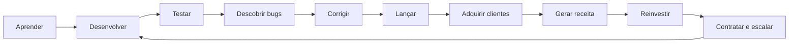
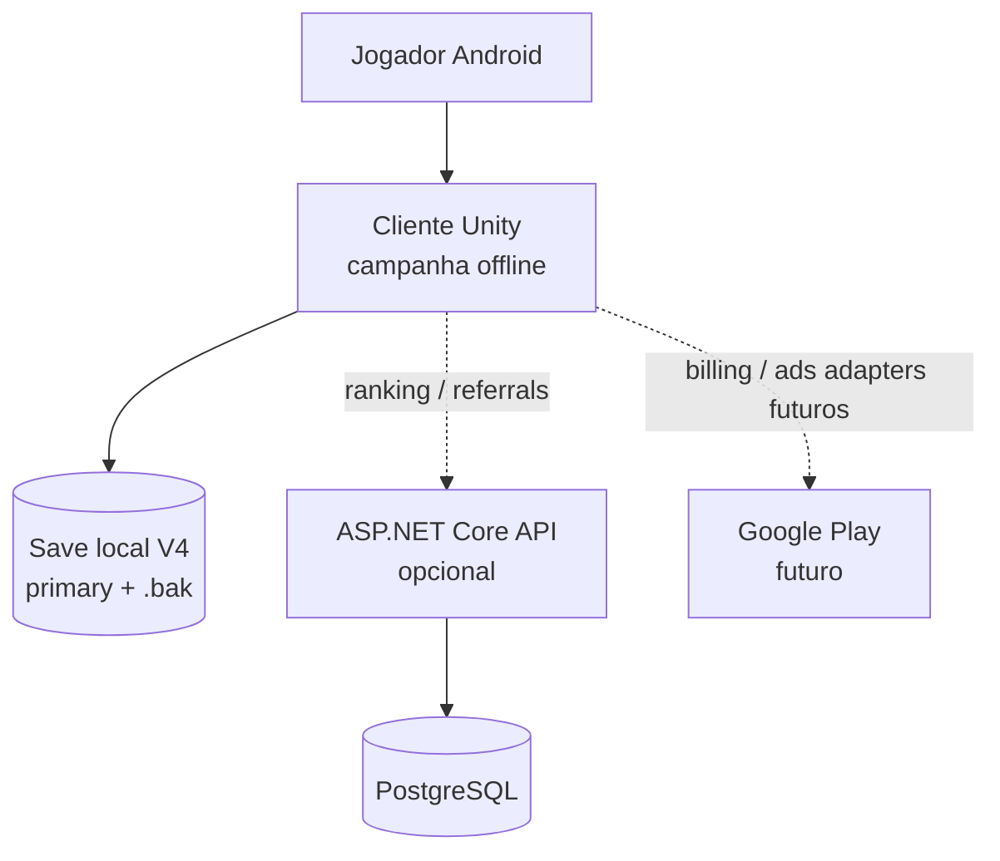
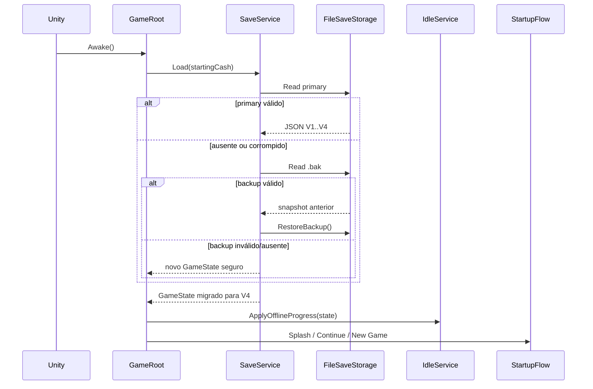
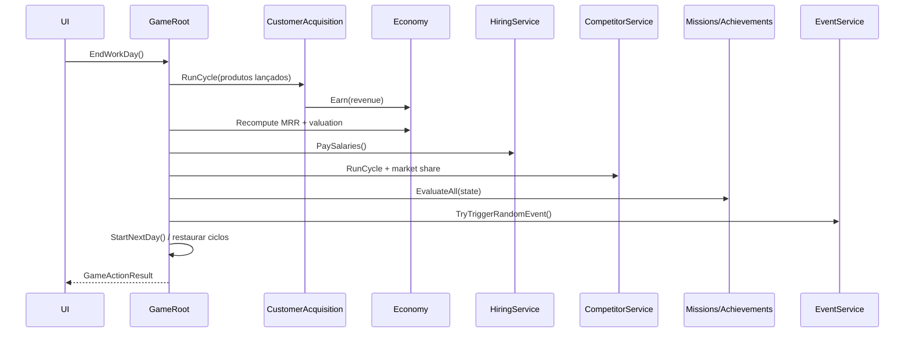
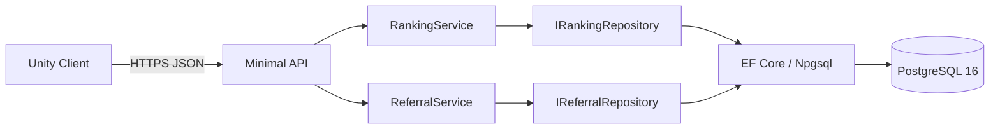

# Startup Empire

> Um tycoon mobile offline-first sobre transformar o primeiro código escrito em um quarto em uma empresa global — com produto, clientes, equipe, capital, concorrência e risco de verdade.

[](ProjectSettings/ProjectVersion.txt)
[](Assets/Game/EditorTools/AndroidBuilder.cs)
[](Tests.NET/StartupEmpire.Domain.Tests.csproj)
[](#qualidade-e-evidências)
[](Assets/Game/Save/SaveMigrator.cs)
[](ARCHITECTURE.md)

Startup Empire combina **Tycoon + Idle + Strategy + Business Simulator + Interactive Career**. O jogo principal funciona sem rede; o backend é uma capacidade opcional para ranking, referrals e futuras funções de identidade/cloud save.

Este repositório não é apenas uma proposta arquitetural. Ele contém domínio executável, UI Unity jogável, persistência versionada com recuperação, backend ASP.NET Core/PostgreSQL, testes reais e um APK Android gerado pelo pipeline Unity/IL2CPP/Gradle.

> [!IMPORTANT]
> “APK gerado” e “runtime Android validado” são gates diferentes. O APK atual foi construído e inspecionado, mas ainda não passou por smoke test porque o emulador disponível está offline. O README não promove evidência parcial a conclusão ampla.

---

## Sumário

- [Resumo executivo](#resumo-executivo)
- [Maturidade e evidências](#maturidade-e-evidências)
- [Produto e loop de jogo](#produto-e-loop-de-jogo)
- [Arquitetura do sistema](#arquitetura-do-sistema)
- [Fluxos de runtime](#fluxos-de-runtime)
- [Mapa do domínio](#mapa-do-domínio)
- [Invariantes de engenharia](#invariantes-de-engenharia)
- [Economia e fórmulas](#economia-e-fórmulas)
- [Persistência e recuperação](#persistência-e-recuperação)
- [UI/UX mobile](#uiux-mobile)
- [Backend opcional](#backend-opcional)
- [Estrutura do repositório](#estrutura-do-repositório)
- [Toolchain e pré-requisitos](#toolchain-e-pré-requisitos)
- [Quick start](#quick-start)
- [Qualidade e evidências](#qualidade-e-evidências)
- [Build Android reproduzível](#build-android-reproduzível)
- [Configuração e segredos](#configuração-e-segredos)
- [Segurança e threat model](#segurança-e-threat-model)
- [Performance](#performance)
- [Observabilidade e diagnóstico](#observabilidade-e-diagnóstico)
- [Workflow de contribuição](#workflow-de-contribuição)
- [Definition of Done e release gates](#definition-of-done-e-release-gates)
- [Troubleshooting](#troubleshooting)
- [Riscos e dívida técnica](#riscos-e-dívida-técnica)
- [Roadmap](#roadmap)
- [Documentação relacionada](#documentação-relacionada)

---

## Resumo executivo

### Objetivo do produto

Entregar uma campanha mobile em que decisões de carreira e negócio sejam expressas por sistemas conectados — não apenas por uma sequência de botões. Tempo, conhecimento, caixa, qualidade, bugs, estabilidade, clientes e equity competem entre si.

```text
Quarto → Freelancer → Primeiro Produto → Microempresa → Startup
       → Escritório → SaaS → Equipe → Investidores
       → Empresa Global → IPO
```

### Decisões estruturais

| Decisão | Consequência desejada |
|---|---|
| Domínio em C# puro | regras testáveis sem carregar cena ou Editor |
| Unity como shell | UI encaminha intenção; `GameState` permanece fonte de verdade |
| Offline-first | campanha não depende de disponibilidade do backend |
| Serviços pequenos | composição substitui um God Object de regras |
| Configuração centralizada | balanceamento não fica espalhado em números mágicos |
| Save DTO versionado | novos campos não invalidam campanhas existentes |
| Adapters nulos | ranking/referrals/anúncios falham fechados sem travar gameplay |
| Backend com validação própria | cliente não é autoridade para ranking/referrals |
| Testes em três níveis | domínio, integração Unity e integração HTTP cobrem riscos diferentes |

### O que já é concreto

- campanha inicial jogável: aprender, desenvolver, testar, corrigir, lançar e adquirir o primeiro cliente;
- quatro ciclos limitados de trabalho por dia;
- economia, lifecycle de produto, clientes, funcionários, pesquisa, upgrades, missões, conquistas e eventos;
- concorrentes, investimentos com diluição, gems e loja sem pagamento real;
- Splash, Main Menu, Novo Jogo, Continuar e 13 telas internas;
- save schema V4 com migrações e snapshot `.bak` recuperável;
- backend opcional para ranking e referrals;
- 160 testes locais passando;
- APK debug Android real com ícone original, portrait e safe area.

---

## Maturidade e evidências

Legenda:

- **Verificado** — executado nesta máquina e apoiado por saída/teste/artefato.
- **Implementado** — código integrado e compilado, mas falta uma validação externa específica.
- **Em evolução** — fluxo funcional com acabamento ou cobertura ainda incompletos.
- **Pendente** — não deve ser tratado como entregue.

| Capacidade | Maturidade | Evidência autoritativa | Gap aberto |
|---|---|---|---|
| Domínio de gameplay | Verificado | 94 testes `.NET` + 35 EditMode | balanceamento por playtest |
| UI Unity | Em evolução | 9 PlayMode; onboarding e navegação funcionais | Development dedicada e polish |
| Save V4 | Verificado | round-trip, migrações, corrupção, `.bak` e filesystem real | cloud save futuro |
| Offline progress | Verificado | testes determinísticos com relógio falso | resumo visual dedicado |
| Backend | Verificado localmente | 22 testes; HTTP + SQLite; PostgreSQL Docker já exercitado | autenticação/ownership |
| APK debug | Verificado como build | BuildReport sem erro/aviso, hash e `aapt2` | execução em device |
| Runtime Android | Pendente | `adb devices` reporta emulador offline | smoke + logcat + matriz de telas |
| AAB/release signing | Pendente | nenhum artefato release alegado | chave externa e pipeline |
| Arte interna | Em evolução | ícone original integrado | linguagem visual final |
| Áudio | Implementado como sistema | mixer lógico e testes | clipes finais licenciados/originais |
| Monetização real | Pendente por decisão | interfaces/adapters preparados | Billing/Ads SDK e compliance |

O histórico verificável fica em [PROGRESS.md](PROGRESS.md); limitações de handoff em [CLAUDE.md](CLAUDE.md).

---

## Produto e loop de jogo

### Loop operacional



### Pressões de decisão

| Recurso | Escassez/risco | Decisão típica |
|---|---|---|
| Ciclos de trabalho | 4 por dia | estudar agora ou entregar feature |
| Caixa | despesas, salários, infraestrutura | contratar, fazer upgrade ou preservar runway |
| Conhecimento | acelera desenvolvimento e qualidade | especializar ou lançar cedo |
| Qualidade/estabilidade | afetam aquisição, churn e bugs | corrigir ou aceitar risco reputacional |
| Clientes pagantes | geram receita e também churn | preço, qualidade e escala |
| Equity | dilui a cada rodada | bootstrapping versus capital externo |
| Reputação | influencia crescimento e eventos | velocidade versus confiança |

### Capítulo 1

O onboarding não é uma parede de texto. `TutorialStep` acompanha o estado real da campanha:

```text
LearnFundamentals
  → DevelopProduct
  → TestProduct
  → FixKnownBugs (quando aplicável)
  → LaunchProduct
  → AcquireFirstCustomer
  → Completed
```

O estado é recalculado pelas ações do domínio; agir fora da ordem sugerida não prende o tutorial. A etapa é persistida no schema V4.

---

## Arquitetura do sistema

### Contexto



### Camadas e regra de dependência

```text
┌───────────────────────────────────────────────────────────────┐
│ Presentation — Unity/uGUI                                     │
│ GameShellBuilder · StartupFlowBuilder · Screen panels         │
├───────────────────────────────────────────────────────────────┤
│ Application / Composition                                     │
│ GameRoot · orchestration · EventBus · adapters                │
├───────────────────────────────────────────────────────────────┤
│ Domain                                                        │
│ Core · Economy · Products · Employees · Research · Events ... │
├───────────────────────────────────────────────────────────────┤
│ Persistence / Integration                                     │
│ SaveService · storages · HTTP clients · null implementations  │
├───────────────────────────────────────────────────────────────┤
│ Optional server                                               │
│ Minimal API · domain services · EF Core · PostgreSQL          │
└───────────────────────────────────────────────────────────────┘
```

| Origem | Pode depender de | Não deve depender de |
|---|---|---|
| Domain | BCL + outros tipos de domínio explícitos | GameObject, MonoBehaviour, Text, cena |
| Application | domínio + interfaces de integração | detalhes espalhados de SDK externo |
| UI | `GameRoot`/estado somente para leitura e comandos | armazenar regra ou progresso canônico |
| Save | DTOs/catálogos e abstração de storage | hierarquia visual |
| Backend | seu próprio domínio/repos | memória ou estado confiado do cliente |

### Composition root

`GameRoot` é o único composition root da cena. Ele:

1. instancia configurações e catálogos;
2. conecta serviços por composição;
3. seleciona adapters offline/HTTP;
4. carrega o save;
5. garante conteúdo inicial;
6. aplica progresso offline;
7. expõe comandos atômicos para a UI;
8. executa autosave em intervalo, pause e quit.

Isso não torna `GameRoot` fonte das fórmulas. Cálculos permanecem em serviços como `EconomyEngine`, `DevelopmentService` e `CustomerAcquisitionService`.

### Eventos internos

`EventBus` desacopla efeitos e observadores. Eventos de receita, clientes, bugs, lançamento, offline, missões e conquistas podem ser consumidos sem a UI conhecer a origem da mutação.

---

## Fluxos de runtime

### Inicialização e recuperação



### Encerramento de um dia



### Ações atômicas

Comandos de trabalho validam pré-condições antes de consumir tempo. O contrato operacional é:

```text
validar alvo → validar duração/fase → reservar ciclo → aplicar domínio → retornar resultado
```

Se a ação é rejeitada, o estado e os ciclos permanecem inalterados e a UI recebe uma mensagem apresentável.

---

## Mapa do domínio

| Bounded area | Tipos centrais | Responsabilidade |
|---|---|---|
| Core | `GameState`, `PlayerState`, `GameRoot`, `EventBus` | aggregate state, tempo e composição |
| Economy | `EconomyEngine`, `EconomyState`, `LedgerEntry` | caixa, MRR, valuation, cash flow, equity |
| Products | `ProductState`, `DevelopmentService` | desenvolvimento, bugs, teste e lançamento |
| Customers | `CustomerAcquisitionService` | aquisição, conversão, churn e receita |
| Research | `LearningService`, `KnowledgeTracks` | conhecimento e produtividade |
| Upgrades | `UpgradeService`, `UpgradeCatalog` | curvas de custo e multiplicadores |
| Employees | `HiringService`, `EmployeeRoster` | contratação, folha, experiência e satisfação |
| Progression | `ProgressionService`, `CompanyStage` | gates de estágio da empresa |
| Missions | `MissionService`, `MissionDefinition` | objetivos desacoplados da UI |
| Achievements | `AchievementService` | conquistas locais |
| Events | `EventService`, `GameEventDefinition` | eventos data-driven e escolhas |
| Competitors | `CompetitorService` | crescimento determinístico e market share |
| Investment | `InvestmentService` | rodadas, elegibilidade e diluição |
| Idle | `OfflineProgressCalculator` | progresso offline capped/batch |
| Premium | `GemWalletService` | saldo e ledger de gems |
| Store | `StoreService` | boosts, itens e cosméticos |
| Save | `SaveService`, `SaveMigrator` | serialização, migração e recuperação |
| Ranking/Referrals | clients + null adapters | integração online opcional |
| Statistics | `StatisticsService` | snapshot derivado, sem estado duplicado |

---

## Invariantes de engenharia

Essas propriedades são parte do contrato do jogo e não simples detalhes de implementação:

1. **A UI não é fonte de verdade.** Fechar/reabrir uma tela nunca cria progresso.
2. **Falha não consome tempo.** Uma ação rejeitada não altera ciclos nem domínio.
3. **Caixa não fica negativo por compra.** `TrySpend` verifica capacidade antes do ledger.
4. **Lançamento exige desenvolvimento completo e ao menos um teste.**
5. **Bug oculto não pode ser corrigido.** Teste converte parte do total em conhecido.
6. **MRR deriva dos produtos.** Não é uma segunda fonte manual de clientes.
7. **Diluição é multiplicativa.** Rodadas consecutivas não subtraem percentuais ingenuamente.
8. **Evento pendente não é sobrescrito.** Uma escolha deve ser resolvida antes de novo evento.
9. **Ranking nunca bloqueia campanha.** Falha de rede é degradada para comportamento offline.
10. **Save novo não ressuscita backup antigo.** Principal, `.bak` e temporários são removidos juntos.
11. **Migração é monotônica.** Dados antigos chegam ao schema atual antes da hidratação.
12. **Relógio negativo não gera benefício.** Progresso offline ignora elapsed ≤ 0.
13. **Teste batch não toca save real.** `Application.isBatchMode` seleciona storage em memória.
14. **Segredo não pertence ao repositório.** Connection strings reais, tokens e keystores ficam externos.

Mudanças que quebram um invariante exigem decisão explícita, atualização de documentação e teste de regressão.

---

## Economia e fórmulas

Os valores-base ficam em classes `*ConfigValues`; as fórmulas abaixo descrevem o comportamento atual, não um balanceamento final.

### Receita recorrente e valuation

```text
MRR = Σ(clientesPagantes × preço)
      para produtos em Launched ou Maintenance

valuation = max(0, MRR × 12 × 3)
```

Os multiplicadores `12` e `3` são `ValuationMrrMultiple` e `ValuationSectorMultiplier`.

### Aquisição, conversão e churn por ciclo

```text
novosUsuários = round(5 × reputação × qualidade × acquisitionMultiplier × ciclos)
novosPagantes = round(novosUsuários × 0,10)
churnRate      = 0,05 + 0,10 × (1 - estabilidade)
churn          = round(clientesPagantes × churnRate × ciclos)
receita        = clientesPagantesApósChurn × preço × ciclos
```

`acquisitionMultiplier` agrega upgrades, marketing e boosts ativos.

### Desenvolvimento

```text
speedMultiplier = (1 + conhecimento × 0,02) × devSpeedMultiplier
progresso        = 10 × speedMultiplier × ciclos
qualityFactor    = clamp(0,30 + conhecimento × 0,01, 0,30, 0,95)
```

Bugs introduzidos consideram progresso, bug rate do produto, redução por upgrade e qualidade.

### Offline

```text
horasAplicadas = clamp(rawElapsedHours, 0, 12)
receitaOffline = clientesPagantes × preço × 0,50 × horasAplicadas
bugsOffline    = round((1 - estabilidade) × horasAplicadas × 0,10)
```

O cálculo é em lote, usa UTC e possui teto de 12 horas. É mitigação razoável para um jogo offline, não DRM invasivo.

### Investimento

```text
equityApósRodada = max(0, equityAtual × (1 - equityCedida))
```

> [!WARNING]
> O rótulo MRR é mensal, mas o ciclo atual reconhece `clientes × preço` por ciclo. A unidade econômica do “dia” ainda precisa ser consolidada no balanceamento antes de release comercial.

---

## Persistência e recuperação

### Artefatos locais

```text
Application.persistentDataPath/
├── save_v1.json          snapshot principal
├── save_v1.json.bak      snapshot anterior
├── save_v1.json.tmp      temporário de escrita (transiente)
└── save_v1.json.restore.tmp (transiente de restore)
```

O nome físico preserva `v1` por compatibilidade; a versão lógica é `SchemaVersion = 4` dentro do JSON.

### Evolução do schema

| Schema | Introdução | Estratégia de migração |
|---:|---|---|
| V1 | estado-base | normaliza coleções e identificador do jogador |
| V2 | bugs conhecidos + teste | preserva bugs legados como conhecidos e infere teste pela fase |
| V3 | calendário de trabalho | dia 1, quatro ciclos/dia e ciclos restantes seguros |
| V4 | tutorial contextual | produto já lançado implica onboarding concluído |

### Pipeline de escrita

1. construir `SaveDataV1` a partir do aggregate;
2. serializar com Newtonsoft.Json;
3. escrever o JSON completo em `.tmp`;
4. copiar o principal atual para `.bak`, quando existir;
5. substituir o principal pelo temporário;
6. limpar temporário no `finally`.

### Pipeline de leitura

```text
primary existe e desserializa?
├── sim → migrar → validar/hidratar
└── não → backup existe e desserializa?
          ├── sim → restaurar primary best-effort → migrar → hidratar
          └── não → criar estado novo com defaults seguros
```

### Contratos

- `ISaveStorage`: storage mínimo local/cloud.
- `IRecoverableSaveStorage`: capacidade opcional de snapshot anterior.
- `FileSaveStorage`: implementação Android/Unity.
- `InMemorySaveStorage`: testes e batch mode.
- `SaveMigrator`: única porta para evolução de schema.

Adicionar campo persistente exige: default seguro, DTO, write, read, migração quando necessária e teste de round-trip/legado.

---

## UI/UX mobile

### Estrutura

- Canvas runtime em `1080 × 1920`, `ScaleWithScreenSize`.
- Portrait travado no builder Android.
- `SafeAreaFitter` respeita notch e barra de gestos.
- Cinco alvos principais largos: Início, Produtos, Equipe, Empresa e Mais.
- Grade secundária para telas de menor frequência.
- Android Back fecha overlay/retorna ao hub antes de sair.
- Modal de evento preserva escolha pendente.

### Fluxo de entrada

```text
Splash → Main Menu
            ├── Continue (somente quando há save)
            └── New Game
                  └── confirmação se já existe progresso
```

### Telas internas atuais

Office, Products, Employees, Research, Missions, Upgrades, Finances, Statistics, Company, Character, Achievements, Store e Settings. Eventos aparecem como modal contextual.

### Regra de apresentação

Painéis implementam `IScreenPanel`:

- `Build` cria hierarquia uma vez;
- `Refresh` relê o estado;
- callbacks chamam comandos de `GameRoot`;
- mensagens usam `GameActionResult` quando a ação pode falhar.

O visual interno ainda é funcional/placeholder. O ícone do app é original e já está integrado.

---

## Backend opcional

### Arquitetura



### Endpoints

| Método | Rota | Responsabilidade |
|---|---|---|
| GET | `/health` | liveness simples |
| POST | `/api/ranking/submit` | validar e fazer upsert da pontuação |
| GET | `/api/ranking/top` | consultar top por métrica |
| GET | `/api/ranking/me/{playerId}` | posição do jogador |
| POST | `/api/referrals/code` | obter/criar código |
| POST | `/api/referrals/redeem` | validar e registrar resgate |

Ranking suporta NetWorth, Valuation, MonthlyRecurringRevenue, Progress e Achievements. O servidor rejeita números negativos/NaN/Infinity, aplica intervalo mínimo e heurística de crescimento implausível.

Referrals rejeitam autoindicação, segundo resgate do mesmo convidado e excesso por indicador.

### Boundary de confiança

O backend valida payloads, mas `PlayerId` ainda é auto-declarado pelo cliente. Portanto:

- adequado para portfólio/ambiente não hostil;
- insuficiente para economia comercial ou premiação real;
- autenticação e ownership são gate obrigatório antes de produção.

Documentação operacional específica: [backend/README.md](backend/README.md).

---

## Estrutura do repositório

```text
StartupEmpire/
├── Assets/Game/
│   ├── Core/           aggregate, relógio, eventos, composition root
│   ├── Economy/        caixa, ledger, MRR, valuation
│   ├── Products/       catálogo, lifecycle, clientes
│   ├── Employees/      catálogo, contratação, folha
│   ├── Research/       conhecimento e aprendizado
│   ├── Progression/    estágios da empresa
│   ├── Missions/       objetivos data-driven
│   ├── Achievements/   conquistas locais
│   ├── Events/         eventos e escolhas
│   ├── Competitors/    simulação leve de mercado
│   ├── Investment/     rodadas e diluição
│   ├── Idle/           progresso offline
│   ├── Save/           DTO, storage, recovery, migrations
│   ├── Premium/        gems e ledger
│   ├── Store/          itens, boosts, cosméticos
│   ├── Ranking/        cliente e adapter nulo
│   ├── Referrals/      cliente e adapter nulo
│   ├── Ads/            interface e adapter nulo
│   ├── Statistics/     snapshots derivados
│   ├── Audio/          mix lógico por categoria
│   ├── UI/             shell, telas, modal, safe area
│   ├── EditorTools/    cena e build Android
│   └── Tests/          EditMode + PlayMode
├── Tests.NET/          mesma fonte C# linkada em suíte rápida
├── backend/
│   ├── StartupEmpire.Api/
│   ├── StartupEmpire.Api.Tests/
│   └── docker-compose.yml
├── Packages/           dependências Unity fixadas
├── ProjectSettings/    configuração versionada do Editor/player
└── *.md                design, arquitetura, progresso e handoff
```

`Tests.NET` não copia o domínio: o `.csproj` usa `<Compile Include="..\Assets\Game\...">`. O arquivo físico testado pelo .NET é o mesmo compilado pelo Unity.

---

## Toolchain e pré-requisitos

| Ferramenta | Versão/uso |
|---|---|
| Git | versionamento |
| Unity Editor | `6000.0.82f1` LTS |
| Unity Android Build Support | SDK + NDK + OpenJDK |
| .NET SDK | 8 para `Tests.NET`; 10 para backend |
| Docker Desktop | PostgreSQL local opcional |
| PowerShell | comandos documentados neste README |
| ADB / aapt2 | fornecidos pelo módulo Android do Unity |

A versão exata do Editor está em [ProjectVersion.txt](ProjectSettings/ProjectVersion.txt). Migrar de versão deve ocorrer em commit isolado, seguido de recompilação, testes e rebuild Android.

### Dependências Unity diretas

- `com.unity.nuget.newtonsoft-json`
- `com.unity.ugui`
- `com.unity.textmeshpro`
- `com.unity.test-framework`
- módulos oficiais de UI, áudio, Android JNI e web request

O lock resolvido fica em `Packages/packages-lock.json`.

---

## Quick start

### Clonar

```powershell
git clone https://github.com/RobersonCodes/StartupEmpire.git
Set-Location StartupEmpire
git status --short --branch
```

### Abrir e jogar

1. No Unity Hub, selecione o Editor `6000.0.82f1`.
2. Abra a raiz do repositório.
3. Abra `Assets/Game/UI/Scenes/Office.unity`.
4. Pressione Play.
5. Atravesse Splash → Novo Jogo.

O backend não precisa estar rodando. `backendBaseUrl` vazio seleciona `NullRankingClient` e `NullReferralClient`.

### Validar o domínio em menos tempo

```powershell
dotnet test Tests.NET/StartupEmpire.Domain.Tests.csproj --nologo
```

### Subir backend local completo

```powershell
Set-Location backend
docker compose up -d

Set-Location StartupEmpire.Api
dotnet user-secrets init
dotnet user-secrets set "ConnectionStrings:Default" "Host=localhost;Port=5442;Database=startup_empire;Username=startup_empire;Password=startup_empire_dev"
dotnet ef database update
$env:ASPNETCORE_ENVIRONMENT = 'Development'
dotnet run
```

Em outro terminal:

```powershell
curl.exe -k https://localhost:5001/health
```

A URL/porta exata aparece no output do `dotnet run`; ajuste o comando de health quando necessário.

---

## Qualidade e evidências

### Resultado local mais recente

Validação executada em 2026-08-21:

| Suíte | Escopo | Passou | Falhou |
|---|---|---:|---:|
| `Tests.NET` | domínio puro, save, economia, sistemas | 94 | 0 |
| Unity EditMode | domínio sob runtime Unity + filesystem | 35 | 0 |
| Unity PlayMode | boot, onboarding, UI, navegação, eventos | 9 | 0 |
| Backend | unidade + HTTP/EF/SQLite em memória | 22 | 0 |
| **Total** |  | **160** | **0** |

> [!NOTE]
> O badge indica a última execução local documentada, não um workflow remoto contínuo. CI ainda é um item de roadmap.

### Estratégia de teste

```text
                  ┌────────────────────┐
                  │ Device smoke (PEND)│
              ┌───┴────────────────────┴───┐
              │ PlayMode: UI + runtime (9) │
          ┌───┴────────────────────────────┴───┐
          │ EditMode: Unity/filesystem (35)    │
      ┌───┴────────────────────────────────────┴───┐
      │ .NET domain (94) + Backend (22)            │
      └────────────────────────────────────────────┘
```

### Comandos

Domínio:

```powershell
dotnet test Tests.NET/StartupEmpire.Domain.Tests.csproj --nologo
```

Backend:

```powershell
dotnet test backend/StartupEmpire.Api.Tests/StartupEmpire.Api.Tests.csproj --nologo
```

Unity EditMode:

```powershell
$unity = 'C:\Program Files\Unity\Hub\Editor\6000.0.82f1\Editor\Unity.exe'
& $unity -batchmode -nographics -projectPath $PWD `
  -runTests -testPlatform EditMode `
  -testResults "$PWD\TestResults\editmode.xml" `
  -logFile "$PWD\TestResults\editmode.log"
```

Unity PlayMode:

```powershell
$unity = 'C:\Program Files\Unity\Hub\Editor\6000.0.82f1\Editor\Unity.exe'
& $unity -batchmode -nographics -projectPath $PWD `
  -runTests -testPlatform PlayMode `
  -testResults "$PWD\TestResults\playmode.xml" `
  -logFile "$PWD\TestResults\playmode.log"
```

Os resultados ficam em `TestResults/`, ignorado pelo Git. Em batch mode o gameplay usa `InMemorySaveStorage`, impedindo contato com o save real.

### O que cada nível não prova

| Evidência | Prova | Não prova |
|---|---|---|
| `.NET` verde | fórmulas e invariantes puras | cena ou toque Android |
| EditMode verde | compilação Unity e integrações de editor/filesystem | layout em device |
| PlayMode verde | hierarquia, callbacks e fluxos de UI | GPU/device real |
| BuildReport verde | player/IL2CPP/Gradle geraram pacote | instalação/execução |
| `aapt2` | manifesto, package, SDK, recursos | comportamento runtime |
| device smoke | boot e interação no hardware testado | cobertura total de aparelhos |

---

## Build Android reproduzível

### Gerar APK debug

```powershell
$unity = 'C:\Program Files\Unity\Hub\Editor\6000.0.82f1\Editor\Unity.exe'
& $unity -batchmode -nographics -projectPath $PWD `
  -executeMethod StartupEmpire.EditorTools.AndroidBuilder.BuildDebugApk `
  -quit -logFile "$PWD\TestResults\android-build.log"
```

O builder configura:

- application id `com.startupempire.game`;
- portrait e autorotate lateral desabilitado;
- render fora da safe area desabilitado;
- ícones legacy e round a partir da arte original;
- cena `Assets/Game/UI/Scenes/Office.unity`;
- `BuildOptions.Development`.

### Artefato verificado atual

```text
Path:       Builds/Android/StartupEmpire-debug.apk
Bytes:      45.621.360
SHA-256:    BB9B2A69733CB99D300195AC781A7DF1A7AFF9F3F21AE607D0928D651E58153D
Package:    com.startupempire.game
Version:    1.0 (versionCode 1)
minSdk:     23
targetSdk:  36
Orientation: portrait
BuildReport: Succeeded, 0 errors, 0 warnings
```

O APK é ignorado pelo Git. Repositório limpo não implica que o artefato exista na máquina recém-clonada.

### Verificar artefato

```powershell
$sdk = 'C:\Program Files\Unity\Hub\Editor\6000.0.82f1\Editor\Data\PlaybackEngines\AndroidPlayer\SDK'
$apk = "$PWD\Builds\Android\StartupEmpire-debug.apk"

Get-Item $apk | Select-Object FullName, Length, LastWriteTime
Get-FileHash -Algorithm SHA256 $apk
& "$sdk\build-tools\36.0.0\aapt2.exe" dump badging $apk
& "$sdk\build-tools\36.0.0\aapt2.exe" dump xmltree $apk --file AndroidManifest.xml |
  Select-String 'screenOrientation'
```

### Smoke test quando houver device online

```powershell
$adb = 'C:\Program Files\Unity\Hub\Editor\6000.0.82f1\Editor\Data\PlaybackEngines\AndroidPlayer\SDK\platform-tools\adb.exe'
$apk = "$PWD\Builds\Android\StartupEmpire-debug.apk"

& $adb devices
& $adb install -r $apk
& $adb logcat -c
& $adb shell monkey -p com.startupempire.game -c android.intent.category.LAUNCHER 1
& $adb logcat -d | Select-String 'Unity|AndroidRuntime|FATAL EXCEPTION'
```

Não execute `adb install` enquanto o device aparecer como `offline`.

---

## Configuração e segredos

### Cliente

`backendBaseUrl` é serializado no `GameRoot` e vazio por padrão. Não coloque token estático, senha ou chave privada em assets/scripts.

### Backend

Ordem de configuração recomendada:

1. variável `ConnectionStrings__Default` em ambiente/secret manager;
2. `dotnet user-secrets` em desenvolvimento;
3. nunca usar o fallback `CHANGE_ME` como configuração real.

### Arquivos proibidos no Git

- `.env*` com credenciais;
- `appsettings.Development.json` real;
- `.jks`, `.keystore` e senhas de assinatura;
- tokens de Google Play, ads, analytics ou cloud;
- dumps de banco com dados pessoais.

O `.gitignore` já cobre os principais formatos, mas prevenção final depende de revisão e secret scanning em CI futuro.

---

## Segurança e threat model

### Boundary atual

| Ativo | Ameaça | Mitigação atual | Residual |
|---|---|---|---|
| Save local | corrupção por crash | temporário + `.bak` + restore | adulteração intencional ainda possível |
| Offline rewards | avanço de relógio | UTC, elapsed negativo ignorado, teto de 12h | relógio ainda é controlado pelo device |
| Ranking | payload impossível | validação, rate-limit, growth heuristic | identidade não autenticada |
| Referrals | auto/duplo resgate | regras de domínio + índice único | farms multi-device sem identidade forte |
| Secrets | vazamento no repo | ignore + configuração externa | CI de secret scanning ausente |
| Ads/Billing | crédito indevido | adapters e nenhum pagamento real | integração real ainda não auditada |

### Antes de monetização comercial

- autenticação verificável e vínculo de conta;
- validação server-authoritative para recompensas online;
- Play Integrity quando proporcional ao risco;
- Google Play Billing com acknowledgement e verificação de compra;
- política de privacidade, consentimento e data retention;
- rotação de secrets e least privilege;
- threat model revisado por fluxo de fraude.

Não há ofuscação/criptografia do save como alegação de segurança. Em jogo offline, elas apenas aumentariam o custo de adulteração; não criariam autoridade confiável.

---

## Performance

### Estratégias já aplicadas

- nenhum `Update()` por entidade de domínio;
- cálculo de offline em lote, não tick-a-tick;
- serviços C# sem alocação por frame como modelo de simulação;
- uma atualização central de top bar/modal;
- concorrentes por fórmulas leves, sem IA pesada;
- UI construída uma vez e atualizada por `Refresh`.

### Budgets propostos para gate mobile

Estes são **alvos**, ainda não medições concluídas:

| Métrica | Budget inicial |
|---|---:|
| Frame time | ≤ 16,7 ms em 60 fps ou ≤ 33,3 ms em 30 fps estável |
| Managed alloc contínuo | ~0 B/frame no hub ocioso |
| ANR/crash no smoke | 0 |
| Cold start | medir em device intermediário |
| Memória PSS | medir e registrar por dispositivo |
| Offline batch 12h | sem loop proporcional a segundos ausentes |

O gate real exige Unity Profiler/Memory Profiler e pelo menos um Android intermediário; ainda não há números registrados.

---

## Observabilidade e diagnóstico

### Cliente

- `Debug.Log` registra progresso offline aplicado e resultado do Android build.
- exceções Unity e Android devem ser coletadas via Editor log/logcat.
- analytics existe apenas como espaço arquitetural; não há coleta invasiva configurada.

### Backend

- `/health` fornece liveness básica;
- logging padrão ASP.NET Core está disponível;
- ainda faltam readiness de banco, métricas, tracing e alertas para produção.

### Artefatos úteis

```text
TestResults/editmode.xml
TestResults/editmode.log
TestResults/playmode.xml
TestResults/playmode.log
TestResults/android-build.log
```

São evidências locais e ficam fora do Git. Falhas devem ser investigadas pelo primeiro erro causal, não apenas pelo exit code final.

---

## Workflow de contribuição

### Antes de editar

```powershell
git status --short --branch
git log -10 --oneline
```

Leia [CLAUDE.md](CLAUDE.md) e [PROGRESS.md](PROGRESS.md). Preserve mudanças não relacionadas do working tree.

### Convenção de commits

```text
feat(economy): implement cash flow simulation
feat(save): recover progress from rotating backup
test(idle): cover offline earnings cap
fix(android): respect safe area on portrait devices
docs(readme): document engineering runbooks
```

### Regras de mudança

- regra determinística nova precisa de teste de domínio;
- UI nova precisa de pelo menos um caminho PlayMode de alto valor;
- campo persistente exige compatibilidade e migração;
- integração externa exige interface e fallback;
- mudança Android relevante exige rebuild e inspeção do artefato;
- documentação deve registrar evidência e limitação, não intenção.

### Sequência recomendada

```text
inspecionar → implementar pequeno incremento vertical → testar domínio
→ testar Unity/backend quando afetado → gerar artefato quando afetado
→ atualizar docs → revisar diff → commit semântico
```

Push é uma ação separada: confirme branch, remoto e intenção antes de publicar.

---

## Definition of Done e release gates

### Feature

- [ ] regra integrada ao fluxo real;
- [ ] UI não guarda estado canônico;
- [ ] erros/precondições retornam feedback útil;
- [ ] teste adequado ao risco;
- [ ] compilação Unity sem erros;
- [ ] persistência coberta quando aplicável;
- [ ] documentação e changelog atualizados;
- [ ] sem TODO/mock permanente no caminho entregue.

### Save migration

- [ ] incrementar schema quando necessário;
- [ ] default seguro para campo ausente;
- [ ] migrar todos os schemas suportados;
- [ ] testar round-trip atual;
- [ ] testar snapshot legado;
- [ ] testar corrupção/fallback;
- [ ] confirmar que Novo Jogo não restaura backup antigo.

### APK debug

- [ ] testes relevantes verdes;
- [ ] `BuildReport = Succeeded`;
- [ ] 0 erros e avisos avaliados;
- [ ] hash SHA-256 registrado;
- [ ] manifest/package/SDK inspecionados;
- [ ] instalação e boot em device quando disponível;
- [ ] logcat sem fatal/ANR.

### Release comercial

- [ ] AAB release reproduzível;
- [ ] signing externo e backup seguro da chave;
- [ ] versionCode/versionName definidos pelo pipeline;
- [ ] autenticação e antifraude proporcionais;
- [ ] Billing/Ads validados em ambiente de teste;
- [ ] privacidade, licenças de arte/áudio e store listing;
- [ ] matriz de devices, performance e acessibilidade;
- [ ] rollback e observabilidade operacional.

---

## Troubleshooting

| Sintoma | Causa provável | Diagnóstico | Ação segura |
|---|---|---|---|
| Unity batch demora ~60s | Licensing Client não conectou | procurar `Licensing` no log | executar fora do sandbox/abrir Hub e repetir |
| Unity sai após importar sem XML | primeira passagem compilou/recarregou domínio | conferir fim do log e timestamp XML | repetir `-runTests` após import |
| `dotnet restore` falha em NuGet | rede/sandbox bloqueou `api.nuget.org` | erro `NU1301` | liberar rede ou usar `--no-restore` se cache válido |
| PlayMode acha objeto de teste anterior | teardown tardio | singleton/UI órfã entre testes | usar `DestroyImmediate` no `UnityTearDown` |
| Backend registra dois providers EF | Npgsql não removido no host de teste | mensagem “single database provider” | remover options e configuração antes do SQLite |
| API não lê user-secrets | ambiente não é Development | inspecionar `ASPNETCORE_ENVIRONMENT` | definir variável antes de `dotnet run` |
| Postgres 5432 não conecta | instância nativa alheia ao projeto | `Get-NetTCPConnection`/Docker | usar Compose isolado na porta 5442 |
| APK existe, mas é antigo | build atual falhou antes de substituir | comparar timestamp/hash e BuildReport | não validar por existência; corrigir e rebuildar |
| ADB mostra `offline` | emulador travado/boot incompleto | `adb devices` | reiniciar emulador/ADB; não instalar ainda |
| Save principal corrompido | escrita externa/crash | parse falha no `SaveService` | backup é carregado/restaurado automaticamente |
| Continue desabilitado | não havia primary nem backup no boot | `SaveService.HasSave` | iniciar Novo Jogo ou restaurar arquivo válido |

### Limpeza segura de processos Unity headless

Identifique o PID exato antes de encerrar; não mate instâncias interativas do usuário por nome indiscriminadamente.

```powershell
Get-Process Unity -ErrorAction SilentlyContinue | Select-Object Id, StartTime, Path
```

---

## Riscos e dívida técnica

| Prioridade | Risco | Impacto | Próxima mitigação |
|---|---|---|---|
| P0 | runtime Android ainda não exercitado | crash/layout pode escapar aos testes | recuperar device e executar smoke/logcat |
| P0 comercial | backend sem autenticação | fraude/impersonation | identity + ownership server-side |
| P1 | unidade econômica ciclo versus MRR | balanceamento inconsistente | definir calendário econômico e simular |
| P1 | UI interna placeholder | baixa legibilidade/percepção de qualidade | design system e tela Development |
| P1 | sem AAB/signing/CI | não publicável | pipeline release com secret externo |
| P1 | save sem cloud | troca de device perde progresso | provider versionado e conflito explícito |
| P2 | RNG de evento não injetável | teste probabilístico mais lento | abstrair random source |
| P2 | áudio sem catálogo final | experiência incompleta | produzir/licenciar e registrar provenance |
| P2 | observabilidade mínima | diagnóstico de produção fraco | logs estruturados, crash reporting, metrics |

---

## Roadmap

### Próximo incremento vertical

1. tela dedicada de Development;
2. conteúdo rolável para listas mobile;
3. estados bloqueados com motivo explícito;
4. cobertura PlayMode do fluxo.

### Antes de beta Android

1. device smoke + logcat;
2. matriz portrait/safe-area/resoluções;
3. performance profiling;
4. balanceamento da unidade econômica;
5. polish de arte e áudio.

### Antes de publicação comercial

1. autenticação/cloud save;
2. AAB, signing e CI;
3. Billing/Ads por adapters auditados;
4. privacy/compliance/licenças;
5. observabilidade e suporte operacional.

O roadmap completo e status item a item estão em [PROJECT-PLAN.md](PROJECT-PLAN.md) e [PROGRESS.md](PROGRESS.md).

---

## Documentação relacionada

| Documento | Uso |
|---|---|
| [PROJECT-PLAN.md](PROJECT-PLAN.md) | ordem de implementação e estado macro |
| [GAME-DESIGN-DOCUMENT.md](GAME-DESIGN-DOCUMENT.md) | visão de produto, loops, progressão e UX |
| [ARCHITECTURE.md](ARCHITECTURE.md) | fronteiras técnicas e persistência |
| [PROGRESS.md](PROGRESS.md) | evidência, bloqueios e trabalho concluído |
| [CHANGELOG.md](CHANGELOG.md) | histórico funcional |
| [CLAUDE.md](CLAUDE.md) | handoff operacional para continuidade |
| [backend/README.md](backend/README.md) | setup, endpoints e PostgreSQL do backend |

---

## Licença

Ainda não há licença pública definida. Até uma licença ser adicionada, todos os direitos permanecem reservados ao autor do projeto. Não presuma permissão para redistribuir código, arte ou binários.
